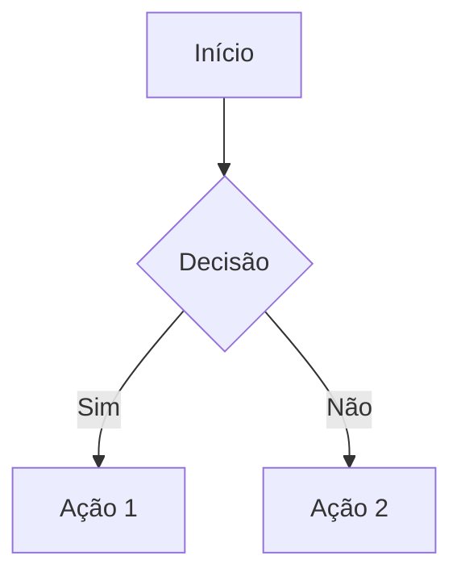

# NIC Chat

**Núcleo de Inteligência e Conhecimento** - Assistente de chat inteligente com sistema de gamificação e jornada de descoberta.

## Visão Geral

NIC Chat é uma aplicação standalone de chat com IA que oferece uma experiência interativa através de uma jornada gamificada de 14 etapas. O sistema rastreia o progresso do usuário, oferece insights proativos e se integra com n8n para processamento de mensagens via streaming.

### Principais Funcionalidades

- **Chat Inteligente**: Interface de conversação com suporte a streaming SSE via n8n
- **Renderização Avançada**:
  - Markdown completo (GFM) com `react-markdown`
  - Diagramas Mermaid interativos
  - Imagens inline (base64, URLs, data URIs)
  - Syntax highlighting para código
  - Botão de copiar mensagens
- **Sugestões Inteligentes**: Sidebar com perguntas sugeridas clicáveis
- **Jornada Gamificada**: 14 etapas distribuídas em 4 fases (Descoberta, Exploração, Domínio, Maestria)
- **Sistema de Progresso**: Barra de progresso visual e badges de conquista
- **Tema Claro/Escuro**: Alternância de temas com persistência em localStorage
- **Floating Action Stack**: 3 FABs expansíveis para acesso rápido (Chat, Índice de Jornada)
- **Responsivo**: Layout adaptativo para desktop e mobile
- **Persistência Local**: Histórico de chat e progresso salvos no navegador

### Páginas Principais

- **Home** (`/`): Landing page com seções Hero, Features, Como Usar e CTA
- **Chat** (`/chat`): Interface full-screen de conversação com histórico e input
- **Admin** (`/admin`): Painel de configurações (jornada, chat, histórico, exportação)

## Arquitetura de Pastas

```
src/chat/
├── src/
│   ├── app/
│   │   ├── App.tsx              # Componente raiz com React Router e providers
│   │   └── main.tsx             # Entry point da aplicação
│   │
│   ├── assets/                  # Imagens e arquivos estáticos
│   │
│   ├── components/
│   │   ├── chat/                # Componentes de chat
│   │   │   ├── ChatHistory.tsx
│   │   │   ├── ChatInput.tsx
│   │   │   ├── ChatMessage.tsx         # Renderização com Markdown + Mermaid
│   │   │   ├── ChatWidgetPanel.tsx
│   │   │   └── SuggestedQuestions.tsx  # Sugestões clicáveis
│   │   │
│   │   ├── gamification/        # Sistema de gamificação
│   │   │   ├── CompletionBadge.tsx
│   │   │   ├── ConfettiEffect.tsx
│   │   │   ├── FloatingActionStack.tsx
│   │   │   ├── JourneyIndexModal.tsx
│   │   │   ├── NextStepWidget.tsx
│   │   │   └── ProgressBar.tsx
│   │   │
│   │   └── layout/              # Componentes de layout
│   │       ├── Footer.tsx
│   │       ├── Header.tsx
│   │       ├── Layout.tsx
│   │       ├── Navigation.tsx
│   │       └── ThemeToggle.tsx
│   │
│   ├── contexts/                # Context API para estado global
│   │   ├── ChatContext.tsx
│   │   ├── JourneyProgressContext.tsx
│   │   ├── NextStepWidgetContext.tsx
│   │   └── ThemeContext.tsx
│   │
│   ├── hooks/                   # Custom hooks
│   │   ├── useChat.ts
│   │   ├── useChatWidget.ts
│   │   ├── useJourneyProgress.ts
│   │   └── useMermaid.ts        # Renderização de diagramas Mermaid
│   │
│   ├── pages/                   # Páginas da aplicação
│   │   ├── Admin.tsx
│   │   ├── Chat.tsx
│   │   └── Home.tsx
│   │
│   ├── services/                # Serviços de API e persistência
│   │   ├── chatService.ts       # Gerenciamento de conversas (localStorage)
│   │   └── n8nChatService.ts    # Integração com n8n (SSE streaming)
│   │
│   ├── styles/
│   │   └── global.css           # Estilos globais e Tailwind imports
│   │
│   ├── types/                   # TypeScript type definitions
│   │   ├── chat.ts
│   │   └── journey.ts
│   │
│   └── utils/                   # Utilidades e configurações
│       └── journeyMap.ts        # Mapa de 14 etapas da jornada NIC
│
├── index.html                   # HTML principal
├── package.json                 # Dependências do projeto
├── vite.config.ts               # Configuração do Vite
├── tsconfig.json                # Configuração TypeScript
├── tailwind.config.js           # Configuração Tailwind + cores NIC
├── postcss.config.js            # Configuração PostCSS
└── README.md                    # Este arquivo
```

## Instalação e Desenvolvimento

### Pré-requisitos

- Node.js 18+ e npm

### Instalação

```bash
cd src/chat
npm install
```

### Executar em Desenvolvimento

```bash
npm run dev
```

A aplicação estará disponível em `http://localhost:3000`

### Verificar TypeScript

```bash
npx tsc
```

## Build de Produção

### Gerar Build

```bash
npm run build
```

Outputs:
- `dist/index.html` - HTML principal
- `dist/assets/*.js` - JavaScript compilado (~1.1MB, 316KB gzip)
  - Inclui biblioteca Mermaid completa (~442KB do Cytoscape + diagramas)
- `dist/assets/*.css` - CSS compilado (~27KB)

### Preview do Build

```bash
npm run preview
```

Inicia servidor local para testar o build de produção.

## Decisões Técnicas

### Stack Principal

- **React 18** com TypeScript (strict mode)
- **Vite** como build tool e dev server
- **React Router v6** para navegação (BrowserRouter)
- **TailwindCSS** para estilização (com `@tailwindcss/typography`)
- **lucide-react** para ícones
- **react-markdown** + **remark-gfm** + **rehype-raw** para Markdown
- **mermaid** para diagramas interativos

### Gestão de Estado

#### Context API (4 contexts)

1. **ThemeContext**: Tema claro/escuro com persistência
2. **ChatContext**: Mensagens, loading, envio/cancelamento
3. **JourneyProgressContext**: Progresso de 14 etapas, settings
4. **NextStepWidgetContext**: Estado do widget de próxima etapa

#### Persistência localStorage

Prefixo `nic-chat-*` para todas as chaves:

- `nic-theme`: Tema atual (`light` ou `dark`)
- `nic-chat-messages`: Histórico de mensagens
- `nic-chat-journey-progress`: Progresso da jornada (JSON)
- `nic-chat-journey-settings`: Configurações do usuário

**Debounce**: 1000ms no JourneyProgressContext para otimizar escritas

### Sistema de Jornada

**14 Etapas em 4 Fases** (cada fase vale 25%):

1. **Descoberta** (0-25%): `descoberta`, `primeiros-passos`, `exploracao-inicial`
2. **Exploração** (25-50%): `conhecendo-recursos`, `pratica-guiada`, `experimentacao`
3. **Domínio** (50-75%): `aprofundamento`, `integracao`, `otimizacao`, `dominio-completo`
4. **Maestria** (75-100%): `maestria-tecnica`, `inovacao`, `compartilhamento`, `excelencia`

**Rastreamento Automático**: Layout.tsx identifica a etapa baseado no pathname

### Integração n8n

- **Endpoint**: `https://n8n.codrstudio.dev/webhook/ciacuidadores.com.br/v1/chat/completions`
- **Protocolo**: SSE (Server-Sent Events) para streaming
- **Formato Request**: `{ sessionId, action: 'sendMessage', chatInput }`
- **Formato Response**: Stream JSON com `{ role, content, timestamp }`

**Configuração**: Define `VITE_N8N_CHAT_URL` no `.env` para sobrescrever o endpoint padrão

**Status Atual**: Conecta direto no webhook n8n (sem necessidade de proxy backend)

### FloatingActionStack

**Design Pattern**: Material Design FAB Stack

- **3 FABs**: Chat principal, FAB de Índice (com badge de %), FAB reservado
- **Comportamento**: Expande no hover, colapsa ao sair
- **Visibilidade**: Oculto em `/chat` e em mobile (< 768px)

### Responsividade

- **Breakpoint**: 768px (Tailwind `md:`)
- **Mobile-first**: Layout vertical, FAB stack oculto
- **Desktop**: Layout horizontal, FAB stack visível

## Cores e Temas

### Paleta NIC (Tailwind Classes)

| Elemento             | Dark Class           | Light Class          | Dark Hex  | Light Hex |
| -------------------- | -------------------- | -------------------- | --------- | --------- |
| **Primária**         | `nic-primary-dark`   | `nic-primary-light`  | `#181818` | `#DEDEDE` |
| **Secundária**       | `nic-secondary-dark` | `nic-secondary-light`| `#212121` | `#FFFFFF` |
| **Destaque**         | `nic-accent-dark`    | `nic-accent-light`   | `#5FBCD3` | `#3D95DF` |
| **Texto Primário**   | `text-gray-200`      | `text-gray-900`      | `#DEDEDE` | `#181818` |
| **Texto Secundário** | `text-white`         | `text-gray-800`      | `#FFFFFF` | `#212121` |

### Configuração Tailwind

As cores NIC estão definidas em `tailwind.config.js`:

```javascript
module.exports = {
  darkMode: 'class',
  theme: {
    extend: {
      colors: {
        'nic-primary-dark': '#181818',
        'nic-primary-light': '#DEDEDE',
        'nic-secondary-dark': '#212121',
        'nic-secondary-light': '#FFFFFF',
        'nic-accent-dark': '#5FBCD3',
        'nic-accent-light': '#3D95DF',
      },
    },
  },
}
```

### Alternância de Tema

- **Componente**: `ThemeToggle.tsx` (botão no Header)
- **Persistência**: localStorage key `nic-theme`
- **Classe CSS**: `.dark` no elemento `<html>`

## Estrutura de Dados

### Message (tipo TypeScript)

```typescript
interface Message {
  id: string
  role: 'user' | 'assistant' | 'system'
  content: string
  timestamp: Date
}
```

### JourneyProgress

```typescript
interface JourneyProgress {
  currentStepId: string
  completedSteps: string[]
  visitedPages: string[]
  lastVisit: Date
}
```

### JourneySettings

```typescript
interface JourneySettings {
  showProgressBar: boolean
  showNextStepWidget: boolean
  autoAdvance: boolean
  notificationsEnabled: boolean
}
```

## Scripts Disponíveis

```bash
npm run dev        # Inicia servidor de desenvolvimento (porta 3000)
npm run build      # Gera build de produção em dist/
npm run preview    # Preview do build de produção
npx tsc            # Validar TypeScript sem gerar arquivos
```

## Validação

### TypeScript

Build completo sem erros:

```bash
npx tsc
# ✓ Zero erros
```

### Build Size

- **JavaScript**: ~1.1MB minificado (~316KB gzip)
  - Inclui Mermaid library completa (suporte a 20+ tipos de diagramas)
- **CSS**: ~27KB (minificado + gzip)

### Dependências

Zero dependências do dashboard (totalmente standalone):

```bash
grep -r "from.*dashboard" src/
# Sem resultados
```

## Recursos Avançados de Chat

### Markdown e Formatação

O NIC Chat suporta **GitHub Flavored Markdown** completo:

- **Negrito**, *itálico*, ~~tachado~~
- Listas numeradas e com marcadores
- Links e imagens inline
- Tabelas
- Code blocks com syntax highlighting
- Blockquotes

### Diagramas Mermaid

Renderização interativa de diagramas usando sintaxe Mermaid:

````markdown

````

Suporta 20+ tipos: flowchart, sequence, class, state, gantt, pie, etc.

### Imagens Inline

Suporte completo a:
- URLs externas: ``
- Base64 data URIs: ``
- QuickChart.io para gráficos dinâmicos

### Copy-to-Clipboard

Todas as mensagens (usuário e assistente) têm botão de copiar com feedback visual.

## Próximos Passos

1. **Deploy**: Hospedar aplicação em produção
   - Configurar `VITE_N8N_CHAT_URL` no ambiente de deploy
   - Configurar rotas SPA (fallback para index.html)
   - Ajustar CORS no n8n webhook se necessário

2. **Otimizações** (opcional):
   - Code splitting para reduzir bundle inicial
   - Lazy load de diagramas Mermaid por tipo
   - Service Worker para cache offline

3. **Analytics** (opcional): Rastreamento de eventos da jornada

## Suporte

Para dúvidas ou problemas, consulte:
- `PRPs/PRP-NIC-Chat-Extraction.md` - Especificação completa do projeto
- `PRPs/TASKS.md` - Histórico de implementação e testes
