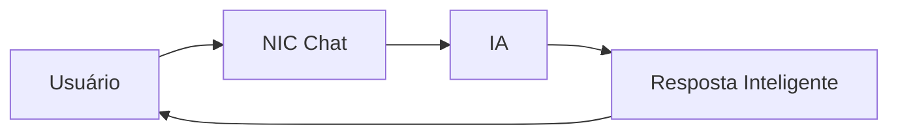

# Recursos do NIC Chat ✨

Descubra tudo que o NIC Chat pode fazer por você! Esta seção apresenta as funcionalidades que tornam o NIC uma ferramenta poderosa e versátil.

## 💬 Chat Inteligente com Streaming

O NIC Chat oferece conversação em tempo real com:

- **Streaming SSE**: Respostas aparecem palavra por palavra, como em uma conversa real
- **Múltiplos provedores**: Suporte a diferentes modelos de IA
- **Histórico persistente**: Suas conversas ficam salvas localmente
- **Cancelamento de respostas**: Pare a geração a qualquer momento

## 🎨 Renderização Avançada

O chat suporta conteúdo rico através de Markdown completo:

### Formatação de Texto

- **Negrito**, *itálico*, ~~tachado~~
- Listas numeradas e com marcadores
- Links e citações
- Tabelas complexas

### Code Blocks com Syntax Highlighting

```javascript
function hello() {
  console.log('NIC Chat é incrível!');
}
```

### Diagramas Mermaid Interativos



### Imagens Inline

Suporte completo a:
- URLs externas
- Base64 data URIs
- Gráficos dinâmicos via QuickChart.io

## 🎯 Sistema de Gamificação

Uma jornada de descoberta com **14 etapas** distribuídas em **4 fases**:

1. **Descoberta** (0-25%): Primeiros passos
2. **Exploração** (25-50%): Conhecendo recursos
3. **Domínio** (50-75%): Aprofundando conhecimento
4. **Maestria** (75-100%): Dominando o sistema

### Acompanhamento Visual

- ✅ Barra de progresso colorida por fase
- 📊 Widget flutuante com próxima etapa
- 🏆 Modal de conquista ao completar 100%
- 🗺️ Índice completo navegável

## 🎨 Temas Claro e Escuro

Interface adaptativa com:

- Alternância rápida de tema
- Persistência da preferência
- Cores otimizadas para cada modo
- Paleta NIC customizada

## 🔧 Altamente Configurável

Painel administrativo para controlar:

- Visibilidade de elementos de gamificação
- Gerenciamento de histórico de conversas
- Exportação de dados
- Configurações de chat

## 💡 Dicas de Uso

💡 **Experimente os diagramas**: Na página de chat, peça para a IA criar um diagrama Mermaid. É impressionante!

💡 **Teste o markdown**: Envie uma mensagem com formatação rica e veja como é renderizada.

💡 **Explore o histórico**: Todas as suas conversas ficam salvas. Você pode voltar a qualquer momento.

## Próximos passos

Continue para a seção **Como Usar** para aprender como começar sua primeira conversa!

---

**Tempo estimado**: 5 minutos
**Pré-requisitos**: Descoberta - Home
**Fase**: Descoberta (0-25%)
