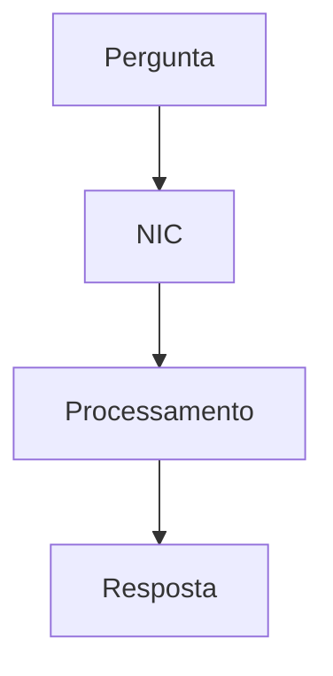

# Primeira Conversa ✍️

Hora de conversar de verdade com o NIC! Nesta etapa, você vai enviar mensagens e explorar os diferentes tipos de resposta.

## 🎯 Missão: Envie 3 Mensagens

Para completar esta etapa, experimente enviar pelo menos **3 mensagens diferentes**:

1. Uma pergunta simples
2. Uma solicitação de código ou diagrama
3. Uma pergunta de acompanhamento

## 💬 Exemplo de Conversa

Veja um exemplo de fluxo de conversa:

### Mensagem 1: Pergunta Simples
```
Usuário: O que é React?
```

**Resposta esperada**: Explicação clara sobre React, suas características e uso.

### Mensagem 2: Solicitação de Código
```
Usuário: Me mostre um exemplo de componente React
```

**Resposta esperada**: Bloco de código JSX formatado com syntax highlighting.

### Mensagem 3: Acompanhamento
```
Usuário: Como eu poderia adicionar estado a esse componente?
```

**Resposta esperada**: Explicação sobre hooks (useState) com exemplo de código.

## 🎨 Tipos de Resposta que Você Verá

### 1. Texto Formatado

Markdown completo com:
- Parágrafos bem estruturados
- Listas organizadas
- Destaques em **negrito** e *itálico*
- Links clicáveis

### 2. Blocos de Código

Com syntax highlighting automático:

```javascript
// Código JavaScript colorido
const greeting = 'Olá, NIC!';
console.log(greeting);
```

```python
# Código Python colorido
def hello():
    print("Olá, NIC!")
```

### 3. Tabelas

Formatação automática de tabelas:

| Recurso | Descrição |
|---------|-----------|
| Streaming | Respostas em tempo real |
| Markdown | Formatação rica |
| Mermaid | Diagramas interativos |

### 4. Diagramas Mermaid

Visualizações gráficas renderizadas:



## 🔄 Comportamento do Streaming

Observe como a resposta aparece:

1. **Início**: Indicador de "digitando..." aparece
2. **Streaming**: Palavras aparecem uma a uma
3. **Renderização**: Markdown é formatado em tempo real
4. **Finalização**: Mensagem completa e formatada
5. **Botão copiar**: Disponível após conclusão

## ✋ Interrompendo Respostas

Se a resposta não estiver boa:

1. Clique em **Cancelar** durante o streaming
2. A geração para imediatamente
3. Texto parcial é mantido
4. Campo de input fica disponível para nova mensagem

## 💡 Dicas para Boas Conversas

### 📝 Seja Específico

**Ruim**: "Me fale sobre programação"
**Bom**: "Explique a diferença entre let e const em JavaScript"

### 🎯 Use Contexto

**Ruim**: "Como faço isso?"
**Bom**: "Como faço para adicionar estado ao componente que você mostrou?"

### 📊 Peça Formatos Específicos

- "Liste os 5 principais..."
- "Crie uma tabela comparando..."
- "Desenhe um diagrama mostrando..."
- "Me dê um exemplo de código para..."

### 🔁 Faça Perguntas de Acompanhamento

A IA lembra do contexto da conversa:
- "Pode explicar melhor essa parte?"
- "E se eu quiser fazer [variação]?"
- "Tem um exemplo mais simples?"

## 🚫 O que Evitar

❌ **Perguntas muito vagas**: "Conte-me tudo"
❌ **Múltiplas perguntas juntas**: Faça uma de cada vez
❌ **Expectativas irreais**: A IA não navega na web nem acessa dados em tempo real
❌ **Informações sensíveis**: Nunca envie senhas ou dados pessoais

## 🎊 Experimente Agora!

Tópicos interessantes para começar:

### Para Desenvolvedores
- "Explique async/await em JavaScript com exemplos"
- "Qual a diferença entre SQL e NoSQL?"
- "Como funciona o Virtual DOM do React?"

### Para Curiosos
- "Explique inteligência artificial para uma criança de 10 anos"
- "Como funciona a internet por baixo dos panos?"
- "Qual a diferença entre Machine Learning e Deep Learning?"

### Para Criativos
- "Crie um diagrama Mermaid de um sistema de e-commerce"
- "Liste 10 ideias de projetos web para portfólio"
- "Sugira uma arquitetura para um app mobile de delivery"

## Próximos passos

Depois de experimentar enviar mensagens, avance para **Streaming de Respostas** para entender melhor como funciona a tecnologia por trás!

---

**Tempo estimado**: 8 minutos
**Pré-requisitos**: Exploração - Interface de Chat
**Fase**: Exploração (25-50%)
