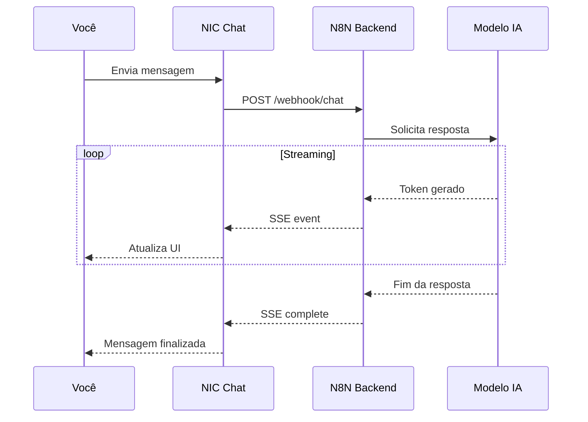

# Streaming de Respostas 📡

Uma das funcionalidades mais impressionantes do NIC Chat é o **streaming em tempo real**. Vamos entender como funciona!

## 🔄 O que é Streaming?

Diferente de chats tradicionais que esperam a resposta completa, o NIC usa **SSE (Server-Sent Events)** para enviar a resposta **palavra por palavra**, em tempo real.

### Comparação

**Chat Tradicional** (sem streaming):
1. Você envia pergunta
2. ⏳ Aguarda 10-30 segundos
3. 💥 Resposta completa aparece de uma vez

**NIC Chat** (com streaming):
1. Você envia pergunta
2. 📡 Resposta começa imediatamente
3. 💬 Palavras aparecem uma a uma
4. ✅ Você pode ler enquanto gera

## 🎯 Vantagens do Streaming

### 1. Feedback Imediato

Você sabe instantaneamente que:
- A mensagem foi recebida
- O processamento começou
- A IA está gerando resposta

### 2. Melhor UX

- **Menos ansiedade**: Não fica esperando sem saber o que está acontecendo
- **Leitura antecipada**: Começa a ler antes da resposta completa
- **Percepção de velocidade**: Parece mais rápido que realmente é

### 3. Cancelamento Inteligente

Como a resposta chega aos poucos:
- Você pode cancelar assim que perceber que não é o que queria
- Economiza tempo e recursos
- Permite reformular a pergunta rapidamente

## 🛠️ Como Funciona Tecnicamente

### Arquitetura



### Fluxo de Dados

1. **Cliente** envia mensagem via fetch API
2. **N8N** processa e conecta com modelo de IA
3. **IA** gera tokens (palavras) incrementalmente
4. **SSE** envia cada token ao navegador
5. **React** atualiza estado e renderiza em tempo real

## 📊 Renderização em Tempo Real

O NIC não apenas mostra texto, mas **renderiza Markdown em tempo real**:

### Texto Simples

```
Olá! Bem-vindo...
```
Aparece palavra por palavra normalmente.

### Markdown Formatado

```
**Negrito** aparece...
```
Renderiza o negrito conforme digita.

### Code Blocks

```javascript
function hello() {
```
Syntax highlighting aplica conforme código completa.

### Diagramas Mermaid

```mermaid
graph TD
```
Renderiza quando bloco é fechado com \`\`\`.

## 🎨 Indicadores Visuais

Durante o streaming você vê:

### 1. Cursor Piscante
Um cursor animado no final do texto indica "digitando..."

### 2. Botão Cancelar
Aparece só durante streaming:
- Clique para interromper
- Texto parcial é mantido
- Campo volta a ficar disponível

### 3. Loading State
Spinner ou indicador antes da primeira palavra aparecer.

## ⚡ Performance

### Otimizações Implementadas

- **Debounce de renderização**: Evita atualizações excessivas
- **Virtual scrolling**: Mantém performance com muitas mensagens
- **Memoização**: Componentes não re-renderizam desnecessariamente
- **Lazy loading**: Carrega apenas mensagens visíveis

### Configurações de Rede

O streaming funciona bem mesmo em conexões lentas:
- Chunks pequenos (~50-100 caracteres)
- Retry automático em caso de falha
- Fallback para modo não-streaming se SSE falhar

## 🧪 Experimente Você Mesmo

Teste o streaming com estas perguntas:

### Resposta Longa
```
Escreva um artigo de 500 palavras sobre inteligência artificial
```
Observe como parágrafos vão aparecendo aos poucos.

### Com Código
```
Crie uma API REST completa em Node.js com Express
```
Veja código ser escrito linha por linha.

### Com Diagrama
```
Desenhe um diagrama de arquitetura de microserviços
```
Aguarde o diagrama ser renderizado ao final.

## 🚀 Tecnologias Envolvidas

- **SSE (Server-Sent Events)**: Protocolo de streaming
- **Fetch API**: Para conexão HTTP
- **React Hooks**: useState + useEffect para gerenciar estado
- **N8N**: Orquestração de workflow
- **OpenAI/Anthropic API**: Modelos de IA com streaming

## 💡 Dicas de Uso

💡 **Cancele cedo**: Se perceber que a resposta não está indo bem, cancele logo.

💡 **Perguntas longas**: Streaming é especialmente útil para respostas extensas.

💡 **Leia enquanto gera**: Não precisa esperar o fim para começar a absorver conteúdo.

💡 **Estabilidade**: Se streaming parar, recarregue a página e tente novamente.

## Próximos passos

Parabéns! Você completou a fase de **Exploração** (50%)! 🎉

Avance para a fase de **Domínio** explorando o **Painel Admin** e suas configurações.

---

**Tempo estimado**: 6 minutos
**Pré-requisitos**: Exploração - Primeira Mensagem
**Fase**: Exploração (25-50%)
**Próxima fase**: Domínio (50-75%)
