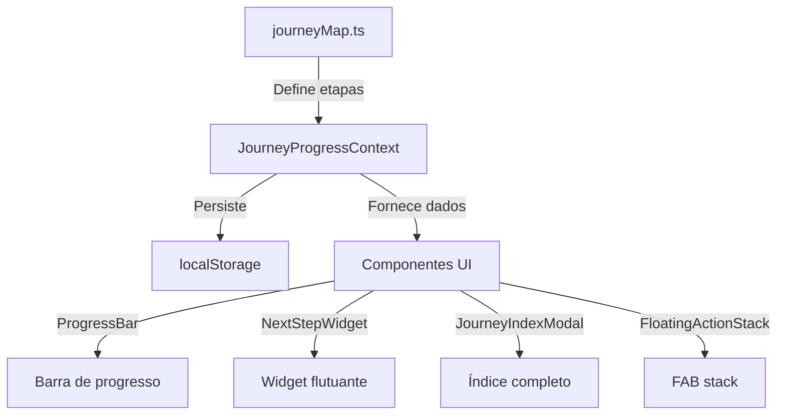

# Sistema de Gamificação 🎮

Domine a arquitetura completa do sistema de jornada gamificada do NIC Chat!

## 🏗️ Arquitetura do Sistema

### Componentes Principais



### 1. journeyMap.ts (Fonte da Verdade)

**O que define:**
- Todas as 14 etapas
- Distribuição de pesos (soma = 100%)
- Fases e suas cores
- Paths e sections

**Exemplo:**
```typescript
export const JOURNEY_MAP: JourneyStep[] = [
  {
    id: 'descoberta-home',
    path: '/',
    label: 'Página Inicial',
    phase: 'descoberta',
    weight: 6.25, // 6.25% do total
    contentPath: '/content/journey/descoberta-home.md'
  },
  // ... mais 13 etapas
]
```

### 2. JourneyProgressContext (Estado Global)

**Responsabilidades:**
- Rastrear páginas visitadas
- Calcular porcentagem de progresso
- Determinar fase atual
- Persistir em localStorage
- Sincronizar entre abas

**Estado:**
```typescript
{
  visitedPages: ['descoberta-home', 'descoberta-features'],
  lastVisited: 'descoberta-features',
  completionPercentage: 12.5,
  currentPhase: 'descoberta',
  timestamp: 1705680000000,
  settings: {
    showProgressBar: true,
    showNextStepWidget: true
  }
}
```

### 3. Componentes de UI

**ProgressBar**: Barra fina colorida no topo
**NextStepWidget**: Card flutuante com próxima etapa
**JourneyIndexModal**: Modal com índice completo
**FloatingActionStack**: Pilha de FABs expansível

## 🎨 Criando Jornadas Customizadas

### Caso de Uso: Sistema de Ticketing

Vamos criar uma jornada para onboarding de sistema de help desk.

#### Passo 1: Definir Etapas

```typescript
// custom-journeys/helpdesk-onboarding.ts

export const HELPDESK_JOURNEY: JourneyStep[] = [
  // Fase 1: Setup (0-25%)
  {
    id: 'setup-account',
    path: '/register',
    label: 'Criar Conta',
    phase: 'descoberta',
    weight: 12.5
  },
  {
    id: 'setup-profile',
    path: '/profile',
    label: 'Completar Perfil',
    phase: 'descoberta',
    weight: 12.5
  },

  // Fase 2: Primeiros Passos (25-50%)
  {
    id: 'first-ticket-view',
    path: '/tickets',
    label: 'Visualizar Tickets',
    phase: 'exploracao',
    weight: 12.5
  },
  {
    id: 'first-ticket-create',
    path: '/tickets/new',
    label: 'Criar Primeiro Ticket',
    phase: 'exploracao',
    weight: 12.5
  },

  // Fase 3: Gestão (50-75%)
  {
    id: 'ticket-assign',
    path: '/tickets/:id',
    section: 'assign',
    label: 'Atribuir Ticket',
    phase: 'dominio',
    weight: 12.5
  },
  {
    id: 'ticket-respond',
    path: '/tickets/:id',
    section: 'respond',
    label: 'Responder Cliente',
    phase: 'dominio',
    weight: 12.5
  },

  // Fase 4: Avançado (75-100%)
  {
    id: 'automation-rules',
    path: '/settings/automation',
    label: 'Criar Regras',
    phase: 'maestria',
    weight: 12.5
  },
  {
    id: 'analytics-dashboard',
    path: '/analytics',
    label: 'Analisar Métricas',
    phase: 'maestria',
    weight: 12.5
  }
]
```

#### Passo 2: Criar Conteúdo Markdown

```markdown
---
id: first-ticket-create
title: Criando Seu Primeiro Ticket
estimatedTime: 5 min
objectives:
  - Entender campos obrigatórios
  - Preencher formulário completo
  - Atribuir prioridade correta
icon: 🎫
---

# Criando Seu Primeiro Ticket 🎫

Aprenda a criar um ticket de suporte profissional...

## Campos Obrigatórios

- **Título**: Resumo em 1 linha
- **Descrição**: Detalhes do problema
- **Prioridade**: Alta, Média, Baixa
...
```

#### Passo 3: Configurar Tracking

```typescript
// hooks/useHelpdeskJourney.ts

export function useHelpdeskJourney() {
  const location = useLocation()
  const { markPageVisited } = useJourneyProgress()

  useEffect(() => {
    // Identificar etapa baseado na URL
    const stepId = identifyJourneyStep(
      location.pathname,
      location.hash
    )

    if (stepId) {
      markPageVisited(stepId)

      // Analytics
      trackEvent('journey_step_completed', {
        step: stepId,
        path: location.pathname
      })
    }
  }, [location])
}
```

#### Passo 4: Customizar Cores

```typescript
// Cores por fase (Helpdesk)
const HELPDESK_PHASE_COLORS = {
  descoberta: 'bg-purple-600',   // Setup
  exploracao: 'bg-blue-600',     // Primeiros passos
  dominio: 'bg-green-600',       // Gestão
  maestria: 'bg-orange-600'      // Avançado
}
```

## 🎯 Padrões de Gamificação

### 1. Progressão Linear

**Estrutura:**
```
Etapa 1 → Etapa 2 → Etapa 3 → ... → Etapa N
```

**Quando usar:**
- Onboarding sequencial
- Tutoriais passo a passo
- Processos com dependências

**Exemplo:** Setup de produto (Cadastro → Email → Perfil → Primeiro uso)

### 2. Progressão por Marcos

**Estrutura:**
```
[Marco 1: 25%]  [Marco 2: 50%]  [Marco 3: 75%]  [Marco 4: 100%]
   ├─ A           ├─ C            ├─ E             ├─ G
   ├─ B           └─ D            └─ F             └─ H
```

**Quando usar:**
- Funcionalidades independentes
- Exploração livre
- Multi-path onboarding

**Exemplo:** Exploração de features (pode fazer em qualquer ordem)

### 3. Progressão Ramificada

**Estrutura:**
```
        ┌─ Desenvolvedor (Etapas 1-5)
Início ─┼─ Designer (Etapas 6-10)
        └─ Gerente (Etapas 11-15)
```

**Quando usar:**
- Diferentes perfis de usuário
- Personalization de jornada
- Skill trees

**Exemplo:** Onboarding baseado em cargo/função

## 🏆 Elementos de Gamificação

### 1. Badges e Conquistas

```typescript
interface Achievement {
  id: string
  title: string
  description: string
  icon: string
  requirement: (progress: JourneyProgress) => boolean
}

const ACHIEVEMENTS: Achievement[] = [
  {
    id: 'early-bird',
    title: 'Madrugador',
    description: 'Completou etapa antes das 6h',
    icon: '🌅',
    requirement: (p) => {
      const hour = new Date(p.timestamp).getHours()
      return hour < 6 && p.completionPercentage > 0
    }
  },
  {
    id: 'speed-runner',
    title: 'Velocista',
    description: 'Completou 50% em menos de 1 hora',
    icon: '⚡',
    requirement: (p) => {
      const elapsed = Date.now() - p.timestamp
      return p.completionPercentage >= 50 && elapsed < 3600000
    }
  }
]
```

### 2. Níveis e XP

```typescript
const LEVELS = [
  { level: 1, xp: 0, title: 'Novato' },
  { level: 2, xp: 100, title: 'Iniciante' },
  { level: 3, xp: 250, title: 'Aprendiz' },
  { level: 4, xp: 500, title: 'Competente' },
  { level: 5, xp: 1000, title: 'Especialista' },
  { level: 6, xp: 2000, title: 'Mestre' }
]

// Ganhar XP por etapa
function calculateXP(step: JourneyStep): number {
  return step.weight * 10 // 6.25% = 62.5 XP
}
```

### 3. Streaks (Sequências)

```typescript
interface Streak {
  current: number // Dias consecutivos
  longest: number // Recorde
  lastVisit: Date
}

function updateStreak(streak: Streak): Streak {
  const today = startOfDay(new Date())
  const last = startOfDay(streak.lastVisit)
  const diff = differenceInDays(today, last)

  if (diff === 0) {
    // Mesmo dia, mantém streak
    return streak
  } else if (diff === 1) {
    // Dia consecutivo, incrementa
    const newCurrent = streak.current + 1
    return {
      current: newCurrent,
      longest: Math.max(newCurrent, streak.longest),
      lastVisit: today
    }
  } else {
    // Quebrou streak, reseta
    return {
      current: 1,
      longest: streak.longest,
      lastVisit: today
    }
  }
}
```

### 4. Leaderboards

```typescript
interface LeaderboardEntry {
  userId: string
  username: string
  completionPercentage: number
  completionTime: number // ms
  rank: number
}

// Exemplo de ranking
const leaderboard: LeaderboardEntry[] = [
  { userId: '1', username: 'João', completionPercentage: 100, completionTime: 1800000, rank: 1 },
  { userId: '2', username: 'Maria', completionPercentage: 75, completionTime: 2400000, rank: 2 },
  // ...
]
```

## 📊 Métricas e Analytics

### Eventos a Rastrear

```typescript
// Início da jornada
trackEvent('journey_started', {
  journeyId: 'helpdesk-onboarding',
  userId: user.id,
  timestamp: Date.now()
})

// Conclusão de etapa
trackEvent('step_completed', {
  stepId: 'first-ticket-create',
  timeSpent: 300000, // 5 min
  percentage: 37.5
})

// Conclusão da jornada
trackEvent('journey_completed', {
  journeyId: 'helpdesk-onboarding',
  totalTime: 3600000, // 1h
  timestamp: Date.now()
})

// Abandono
trackEvent('journey_abandoned', {
  lastStep: 'ticket-assign',
  percentage: 62.5,
  daysSinceLastVisit: 7
})
```

### Métricas Importantes

- **Taxa de conclusão**: % usuários que chegam a 100%
- **Tempo médio**: Quanto tempo leva para completar
- **Drop-off points**: Onde usuários mais abandonam
- **Popularidade de etapas**: Quais são mais/menos visitadas
- **Sequência comum**: Ordem mais frequente de conclusão

## 💡 Melhores Práticas

### ✅ Boas Práticas

💡 **Mantenha curto**: 5-15 etapas é ideal. Mais que isso vira cansativo.

💡 **Distribua pesos justos**: Etapas complexas devem valer mais.

💡 **Permita pular**: Nem todo mundo quer fazer 100%. Torne opcional.

💡 **Feedback visual claro**: Usuário deve sempre saber onde está.

💡 **Celebre conquistas**: Modal de parabéns, confetti, badges.

### ❌ Anti-Padrões

❌ **Bloquear progressão**: Não force usuário a completar etapa antes de usar produto.

❌ **Gamificação forçada**: Respeite quem quer desativar.

❌ **Passos muito longos**: Etapas de 30+ minutos são desmotivadoras.

❌ **Falta de feedback**: Não deixe usuário sem saber o que fazer.

## 🚀 Próximos Passos Avançados

- Adicionar **notificações** de progresso
- Implementar **rewards** (desbloquear features)
- Criar **social proof** (X usuários completaram)
- A/B testing de jornadas diferentes
- Personalização baseada em comportamento

## Conclusão

Você dominou o sistema de gamificação do NIC! Agora vá para a última etapa: **Exportação de Dados**.

---

**Tempo estimado**: 8 minutos
**Pré-requisitos**: Maestria - Widget
**Fase**: Maestria (75-100%)
