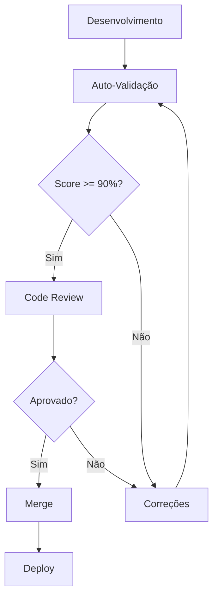

# Checklist de Validação de Módulos

**Versão**: 1.0.0
**Última Atualização**: 2025-01-16
**Status**: Normativo

Este documento serve como checklist definitivo para validar que um módulo está em conformidade com todos os padrões da plataforma.

## 🔍 VALIDAÇÃO AUTOMÁTICA

### Script de Validação

```bash
#!/bin/bash
# validate-module.sh
# Uso: ./validate-module.sh <module-name>

MODULE_PATH="src/frontend/src/modules/$1"

echo "🔍 Validando módulo: $1"
echo "================================"

# 1. Verificar estrutura de diretórios
echo "📁 Verificando estrutura..."

# Arquivos obrigatórios
REQUIRED_FILES=(
  "manifest.ts"
  "index.ts"
)

for file in "${REQUIRED_FILES[@]}"; do
  if [ -f "$MODULE_PATH/$file" ]; then
    echo "  ✅ $file existe"
  else
    echo "  ❌ $file não encontrado"
    exit 1
  fi
done

# 2. Verificar auto-registro
echo "🔗 Verificando auto-registro..."
if grep -q "moduleRegistry.register" "$MODULE_PATH/index.ts"; then
  echo "  ✅ Auto-registro encontrado"
else
  echo "  ❌ Auto-registro não encontrado"
  exit 1
fi

# 3. Verificar import em modules/index.ts
echo "📦 Verificando import global..."
if grep -q "import './$1'" "src/frontend/src/modules/index.ts"; then
  echo "  ✅ Módulo importado em index.ts"
else
  echo "  ❌ Módulo não importado em index.ts"
  exit 1
fi

# 4. Verificar TypeScript
echo "📝 Verificando TypeScript..."
npx tsc --noEmit --project tsconfig.json

echo "✨ Validação concluída com sucesso!"
```

## 📋 CHECKLIST COMPLETO

### 1. ESTRUTURA E ARQUIVOS

#### 1.1 Arquivos Obrigatórios

- [ ] `manifest.ts` - Metadados do módulo
- [ ] `index.ts` - Entry point com auto-registro
- [ ] `README.md` - Documentação do módulo

#### 1.2 Arquivos Condicionais

**Se `providesRoutes: true`:**
- [ ] `routes.tsx` existe
- [ ] `pages/` diretório existe
- [ ] Todas as páginas usam lazy-loading

**Se tem configuração:**
- [ ] `components/setup/<ModuleName>ConfigForm.tsx` existe
- [ ] Implementa `ConfigComponentProps`
- [ ] `schemas/configSchemas.ts` com validação Zod

**Se `providesSlots: true`:**
- [ ] `components/slots/` existe
- [ ] `components/slots/index.ts` exporta array

**Se `providesCompositions: true`:**
- [ ] `compositions.ts` existe

#### 1.3 Estrutura de Diretórios

```
✅ Estrutura Válida:
my-module/
├── assets/          [OPCIONAL]
├── components/      [OBRIGATÓRIO]
├── hooks/           [OPCIONAL]
├── pages/           [SE providesRoutes]
├── types/           [OPCIONAL]
├── schemas/         [SE tem validação]
├── specs/           [OPCIONAL]
├── manifest.ts      [OBRIGATÓRIO]
├── index.ts         [OBRIGATÓRIO]
├── routes.tsx       [SE providesRoutes]
├── compositions.ts  [SE providesCompositions]
└── README.md        [RECOMENDADO]

❌ Evitar:
- src/             # Não criar src dentro do módulo
- lib/             # Usar utils/ ou helpers/
- api/             # Não criar APIs, usar JQEL
- services/        # Lógica em hooks
- store/           # Estado em contextos
```

### 2. MANIFEST.TS

#### 2.1 Campos Obrigatórios

```typescript
- [ ] id: string              // lowercase com hífen
- [ ] version: string         // Semantic versioning (x.y.z)
- [ ] name: string            // Nome para exibição
- [ ] description: string     // Descrição clara
- [ ] type: 'functionality' | 'component'
- [ ] category: 'system' | 'business' | 'productivity' | 'communication'
- [ ] capabilities: object    // Capacidades do módulo
```

#### 2.2 Validações do Manifest

- [ ] ID segue padrão: `^[a-z][a-z0-9-]*$`
- [ ] Version segue semver: `^\d+\.\d+\.\d+$`
- [ ] Capabilities consistente com arquivos:
  - [ ] Se `providesRoutes: true` → `routes.tsx` existe
  - [ ] Se `providesComponents: true` → componentes exportados
  - [ ] Se `providesSlots: true` → `slotComponents` exportado
- [ ] Dependencies lista apenas IDs válidos de módulos existentes
- [ ] Routes usa caminhos relativos (sem `/portal-id`)

### 3. INDEX.TS

#### 3.1 Auto-Registro

```typescript
// ✅ DEVE ter esta linha no final:
moduleRegistry.register(<moduleName>Module);

// ✅ DEVE estar importado em src/modules/index.ts:
import './my-module';
```

#### 3.2 Lazy-Loading

- [ ] ConfigComponent usa `lazy()` se existe
- [ ] Não importa componentes pesados diretamente

#### 3.3 Exports

```typescript
// ✅ Estrutura correta:
export const myModuleModule: ModuleExports = {
  manifest: myModuleManifest,           // SEMPRE
  routes: myModuleRoutes,               // SE providesRoutes
  configComponent: MyModuleConfigForm,  // SE tem config
  slotComponents,                       // SE providesSlots
  compositions,                         // SE providesCompositions
  slotConfigForms,                      // SE tem slot configs
};
```

### 4. ROUTES.TSX

#### 4.1 Lazy-Loading Obrigatório

```typescript
// ✅ CORRETO
const MyPage = lazy(() =>
  import('./pages/MyPage').then(m => ({ default: m.MyPage }))
);

// ❌ INCORRETO
import { MyPage } from './pages/MyPage';
```

#### 4.2 Estrutura de Rotas

- [ ] Caminhos relativos (sem prefixo de portal)
- [ ] Meta com title e description
- [ ] Componentes lazy-loaded
- [ ] Sem rotas duplicadas

### 5. COMPONENTES

#### 5.1 Páginas

- [ ] Usam componente `<Page>` para composição
- [ ] Tratam estados de loading/error
- [ ] Implementam empty states
- [ ] São responsivas

#### 5.2 Configuração

- [ ] Implementa `ConfigComponentProps`
- [ ] Usa React Hook Form + Zod
- [ ] Callbacks `onSave` e `onCancel`
- [ ] Validação funcionando

#### 5.3 Slots

- [ ] Implementam `SlotComponentProps`
- [ ] Recebem e usam `config` prop
- [ ] Registrados em `slotComponents`
- [ ] Têm formulário de configuração

### 6. HOOKS

#### 6.1 JQEL Compliance

```typescript
// ✅ TODOS os dados via JQEL
import { useJQELQuery, useJQELMutation } from '@/hooks/useJQEL';

// ❌ NUNCA fazer isso:
import axios from 'axios';
const data = await fetch('/api/...');
```

#### 6.2 Convenções

- [ ] Começam com `use`
- [ ] Retornam valores consistentes
- [ ] Têm tipos explícitos
- [ ] Documentação JSDoc

### 7. TYPES E SCHEMAS

#### 7.1 TypeScript

- [ ] Sem uso de `any`
- [ ] Tipos explícitos em funções públicas
- [ ] Interfaces para objetos extensíveis
- [ ] Types para unions e aliases

#### 7.2 Zod Schemas

- [ ] Validação completa de config
- [ ] Mensagens de erro em português
- [ ] Tipos derivados dos schemas
- [ ] Defaults definidos

### 8. PADRÕES DE CÓDIGO

#### 8.1 Nomenclatura

- [ ] Componentes: `PascalCase`
- [ ] Hooks: `useCamelCase`
- [ ] Funções: `camelCase`
- [ ] Constantes: `UPPER_SNAKE_CASE`
- [ ] Arquivos de componentes: `PascalCase.tsx`
- [ ] Outros arquivos: `camelCase.ts`

#### 8.2 Imports

- [ ] Organizados por categoria
- [ ] Sem imports não utilizados
- [ ] Assets com paths relativos
- [ ] Sem imports circulares

#### 8.3 Performance

- [ ] Lazy-loading implementado
- [ ] Memoização onde apropriado
- [ ] Sem re-renders desnecessários
- [ ] Bundle size < 50KB por chunk

### 9. UI/UX

#### 9.1 Componentes UI

- [ ] **APENAS** shadcn/ui usado
- [ ] Sem bibliotecas UI externas
- [ ] Tailwind para estilos
- [ ] Mínimo CSS customizado

#### 9.2 Temas

- [ ] Funciona em light mode
- [ ] Funciona em dark mode
- [ ] Usa variáveis CSS do tema
- [ ] Contraste adequado

#### 9.3 Responsividade

- [ ] Mobile (320px - 768px)
- [ ] Tablet (768px - 1024px)
- [ ] Desktop (1024px+)
- [ ] Sem scroll horizontal

### 10. ACESSIBILIDADE

- [ ] Labels em inputs
- [ ] Alt text em imagens
- [ ] ARIA labels onde necessário
- [ ] Navegação por teclado
- [ ] Focus visible
- [ ] Hierarquia de headings

### 11. DOCUMENTAÇÃO

#### 11.1 README.md

- [ ] Descrição clara
- [ ] Funcionalidades listadas
- [ ] Instruções de uso
- [ ] Configurações documentadas
- [ ] Changelog atualizado

#### 11.2 Código

- [ ] JSDoc em funções públicas
- [ ] Comentários explicam "porquê"
- [ ] Sem código comentado
- [ ] TODOs resolvidos ou documentados

### 12. TESTES FUNCIONAIS

#### 12.1 Registro e Inicialização

- [ ] Módulo registra sem erros
- [ ] Aparece no ModuleRegistry
- [ ] Manifest válido

#### 12.2 Rotas

- [ ] Todas as rotas carregam
- [ ] Navegação funciona
- [ ] URLs corretas

#### 12.3 Dados

- [ ] Queries JQEL funcionam
- [ ] Mutations salvam dados
- [ ] Cache funciona
- [ ] Error handling

#### 12.4 Configuração

- [ ] Form abre sem erros
- [ ] Validação funciona
- [ ] Salva configuração
- [ ] Carrega configuração salva

#### 12.5 UI

- [ ] Sem erros no console
- [ ] Sem warnings React
- [ ] Performance adequada
- [ ] Memória estável

### 13. INTEGRAÇÃO

#### 13.1 Portal

- [ ] Funciona no portal "main"
- [ ] Funciona em outros portais
- [ ] Respeita activeModules
- [ ] Homepage configurável

#### 13.2 Composição

- [ ] Slots renderizam corretamente
- [ ] Composições funcionam
- [ ] Config forms funcionam
- [ ] Layout responsivo

#### 13.3 Sistema

- [ ] SSE events (se aplicável)
- [ ] Redis pub/sub (se aplicável)
- [ ] Permissões respeitadas
- [ ] Multi-instance (se aplicável)

### 14. SEGURANÇA

- [ ] Sem dados sensíveis no código
- [ ] Sem tokens/keys hardcoded
- [ ] Input validation
- [ ] XSS prevention
- [ ] CSRF protection (via backend)

### 15. PERFORMANCE

#### 15.1 Métricas

- [ ] First Contentful Paint < 1s
- [ ] Time to Interactive < 3s
- [ ] Bundle size adequado
- [ ] Lazy loading funcionando

#### 15.2 Otimizações

- [ ] Images otimizadas
- [ ] Fonts otimizadas
- [ ] Code splitting
- [ ] Tree shaking

## 🎯 SCORE DE CONFORMIDADE

### Cálculo do Score

```typescript
// Total de itens: ~150
// Score = (Itens Conformes / Total) * 100

function calculateComplianceScore(checklist: ChecklistItem[]): number {
  const total = checklist.length;
  const compliant = checklist.filter(item => item.checked).length;
  return Math.round((compliant / total) * 100);
}
```

### Níveis de Conformidade

| Score | Nível | Status | Ação |
|-------|-------|--------|------|
| 95-100% | A+ | Excelente | Pronto para produção |
| 90-94% | A | Ótimo | Revisar itens pendentes |
| 80-89% | B | Bom | Corrigir issues críticas |
| 70-79% | C | Regular | Refatoração necessária |
| < 70% | D | Insuficiente | Retrabalho significativo |

## 📊 RELATÓRIO DE VALIDAÇÃO

### Template de Relatório

```markdown
# Relatório de Validação - [Nome do Módulo]

**Data**: YYYY-MM-DD
**Validador**: [Nome]
**Versão do Módulo**: x.y.z

## Resumo Executivo

- **Score de Conformidade**: XX%
- **Nível**: A/B/C/D
- **Status**: Aprovado/Reprovado/Em Revisão

## Detalhes da Validação

### ✅ Conformidades (XX itens)
- Item 1
- Item 2
- ...

### ❌ Não-Conformidades (XX itens)
- Issue 1: Descrição e impacto
- Issue 2: Descrição e impacto
- ...

### ⚠️ Avisos (XX itens)
- Aviso 1: Recomendação
- Aviso 2: Recomendação
- ...

## Ações Requeridas

1. [ ] Ação corretiva 1
2. [ ] Ação corretiva 2
3. [ ] Ação corretiva 3

## Recomendações

- Recomendação 1
- Recomendação 2

## Conclusão

[Parecer final sobre o módulo]

---
**Assinatura**: _____________________
```

## 🚀 PROCESSO DE VALIDAÇÃO

### Fluxo Recomendado



### Etapas

1. **Desenvolvimento**
   - Seguir SPEC-MODULE-PATTERNS.md
   - Usar Blueprint como referência

2. **Auto-Validação**
   - Executar este checklist
   - Calcular score
   - Documentar issues

3. **Correções**
   - Resolver non-conformidades
   - Re-validar

4. **Code Review**
   - Revisor usa este checklist
   - Validação independente

5. **Aprovação**
   - Score >= 90%
   - Sem issues críticas
   - Documentação completa

6. **Deploy**
   - Merge para branch principal
   - Registro em changelog

## 🔧 FERRAMENTAS DE VALIDAÇÃO

### ESLint Config

```javascript
// .eslintrc.js para módulos
module.exports = {
  rules: {
    'no-console': 'error',
    'no-unused-vars': 'error',
    'no-any': 'error',
    'react-hooks/rules-of-hooks': 'error',
    'react-hooks/exhaustive-deps': 'warn',
  },
};
```

### TypeScript Config

```json
// tsconfig.json strict mode
{
  "compilerOptions": {
    "strict": true,
    "noImplicitAny": true,
    "strictNullChecks": true,
    "noUnusedLocals": true,
    "noUnusedParameters": true,
  }
}
```

### Pre-Commit Hook

```bash
#!/bin/bash
# .git/hooks/pre-commit

# TypeScript check
npm run type-check

# ESLint
npm run lint

# Validação do módulo
./validate-module.sh

echo "✅ Validações passaram!"
```

## 📚 REFERÊNCIAS

- **Especificação Completa**: `SPEC-MODULE-PATTERNS.md`
- **Guia de Desenvolvimento**: `MODULE-DEVELOPMENT-GUIDE.md`
- **Convenções de Código**: `CODE-CONVENTIONS.md`
- **Módulo de Referência**: `src/frontend/src/modules/blueprint/`
- **Documentação da Plataforma**: `spec/`

---

**Importante**: Este checklist é **NORMATIVO** e deve ser seguido rigorosamente. Módulos que não atingirem score mínimo de 90% não devem ser considerados prontos para produção.

**Última Atualização**: 2025-01-16
**Versão**: 1.0.0