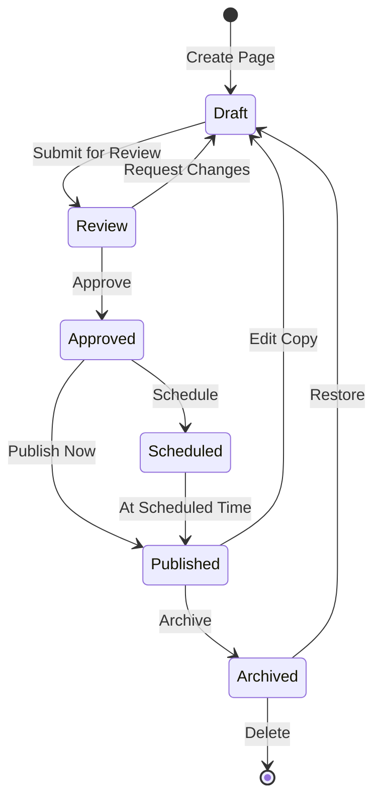

# Sistema Draft/Publish - Módulo Webpage

Este documento especifica o sistema completo de publicação, versionamento e workflow do módulo webpage.

## Índice

1. [Visão Geral](#visão-geral)
2. [Estados de Página](#estados-de-página)
3. [Sistema de Versionamento](#sistema-de-versionamento)
4. [Workflow de Publicação](#workflow-de-publicação)
5. [Publicação Agendada](#publicação-agendada)
6. [Comparação de Versões](#comparação-de-versões)
7. [Rollback e Recovery](#rollback-e-recovery)
8. [Aprovações e Revisões](#aprovações-e-revisões)
9. [API de Publicação](#api-de-publicação)

---

## Visão Geral

### Conceitos Fundamentais

O sistema Draft/Publish separa o conteúdo em edição do conteúdo publicado, permitindo:

- **Edição Segura**: Mudanças não afetam a versão ao vivo até publicação
- **Preview**: Visualizar mudanças antes de publicar
- **Versionamento**: Histórico completo de todas as versões
- **Rollback**: Reverter para versões anteriores
- **Agendamento**: Publicar em data/hora específica
- **Workflow**: Processo de aprovação antes da publicação

### Arquitetura

```
┌─────────────────┐     ┌─────────────────┐     ┌─────────────────┐
│                 │     │                 │     │                 │
│   Draft Store   │────▶│  Preview API    │     │   Visitor API   │
│                 │     │                 │     │                 │
└─────────────────┘     └─────────────────┘     └─────────────────┘
         │                                                │
         │                                                │
         └──────────────────┬────────────────────────────┘
                            │
                    ┌───────▼───────┐
                    │               │
                    │ Publish Queue │
                    │               │
                    └───────────────┘
                            │
                    ┌───────▼───────┐
                    │               │
                    │ Published DB  │
                    │               │
                    └───────────────┘
```

---

## Estados de Página

### Diagrama de Estados



### Definição dos Estados

#### 1. Draft (Rascunho)

**Características**:
- Estado inicial de toda página
- Editável livremente
- Não visível publicamente
- Auto-save ativo

**Interface**:
```
┌─────────────────────────────┐
│ Status: Draft 📝            │
│ Last edited: 2 minutes ago  │
│ By: John Doe                │
│                             │
│ [Save] [Preview] [Submit]   │
└─────────────────────────────┘
```

#### 2. Review (Em Revisão)

**Características**:
- Aguardando aprovação
- Editável apenas com permissão
- Comentários habilitados
- Notificações para revisores

**Interface**:
```
┌─────────────────────────────┐
│ Status: In Review 👁        │
│ Submitted: 1 hour ago       │
│ By: John Doe                │
│ Reviewers: Jane (pending)   │
│                             │
│ [Approve] [Changes] [Cancel]│
└─────────────────────────────┘
```

#### 3. Approved (Aprovado)

**Características**:
- Pronto para publicação
- Bloqueado para edição
- Pode ser agendado
- Aguardando ação final

**Interface**:
```
┌─────────────────────────────┐
│ Status: Approved ✅         │
│ Approved: 30 min ago        │
│ By: Jane Smith              │
│                             │
│ [Publish Now] [Schedule]    │
└─────────────────────────────┘
```

#### 4. Scheduled (Agendado)

**Características**:
- Publicação automática configurada
- Não editável
- Pode ser cancelado
- Countdown visível

**Interface**:
```
┌─────────────────────────────┐
│ Status: Scheduled 🕐        │
│ Publishes in: 2h 30m        │
│ Date: Dec 25, 2024 10:00 AM │
│                             │
│ [Cancel] [Reschedule]       │
└─────────────────────────────┘
```

#### 5. Published (Publicado)

**Características**:
- Visível publicamente
- Versão ao vivo
- Cria draft para edições
- Métricas ativas

**Interface**:
```
┌─────────────────────────────┐
│ Status: Published 🌍        │
│ Live since: Dec 20, 2024    │
│ Views: 1,234                │
│                             │
│ [Edit Copy] [Unpublish]     │
└─────────────────────────────┘
```

#### 6. Archived (Arquivado)

**Características**:
- Removido do público
- Mantém histórico
- Pode ser restaurado
- Não conta para limites

**Interface**:
```
┌─────────────────────────────┐
│ Status: Archived 📦         │
│ Archived: Jan 1, 2025       │
│ Reason: Outdated content    │
│                             │
│ [Restore] [Delete Forever]  │
└─────────────────────────────┘
```

---

## Sistema de Versionamento

### Estrutura de Versões

```typescript
interface Version {
  // Identificação
  id: string;
  version: number;        // 1, 2, 3...
  type: 'major' | 'minor' | 'auto';

  // Metadados
  createdAt: Date;
  createdBy: User;
  message?: string;       // Commit message
  tags?: string[];        // Labels

  // Estado
  status: PageStatus;
  isPublished: boolean;
  publishedAt?: Date;

  // Conteúdo
  page: Page;
  changes: ChangeSet;
  size: number;          // Bytes
}
```

### Numeração de Versões

```
1.0 → Initial version (major)
1.1 → Auto-save
1.2 → Auto-save
2.0 → Manual save with message (major)
2.1 → Auto-save
3.0 → Published version (major)
```

### Interface de Histórico

```
┌──────────────────────────────────────┐
│ Version History                      │
├──────────────────────────────────────┤
│ v15 📝 Draft - Current               │
│     5 min ago • John • Auto-saved   │
│                                      │
│ v14 🌍 Published                    │
│     2 days ago • Jane • "Added CTA" │
│                                      │
│ v13 📝 Draft                         │
│     2 days ago • John • Auto-saved  │
│                                      │
│ v12 ⭐ Checkpoint                    │
│     3 days ago • Team • "Release 2" │
│                                      │
│ [Load More...]                       │
└──────────────────────────────────────┘

Actions: [Compare] [Restore] [Download]
```

### Auto-Save

**Configuração**:
```javascript
const autoSaveConfig = {
  enabled: true,
  interval: 30000,       // 30 seconds
  debounce: 2000,        // 2 seconds after last change
  maxVersions: 50,       // Keep last 50 auto-saves
  compression: true,     // Compress old versions
};
```

**Indicador Visual**:
```
Saving...     → 💾 Saving...
Saved         → ✓ Saved just now
Error         → ❌ Failed to save [Retry]
```

### Checkpoints (Save Points)

**Criar Checkpoint**:
```
┌──────────────────────────────┐
│ Create Checkpoint            │
├──────────────────────────────┤
│ Name: [Release v2.0_____]    │
│                              │
│ Description:                 │
│ [Major redesign of the___]   │
│ [hero section with new___]   │
│                              │
│ Tags: [redesign] [release]   │
│                              │
│ [Create] [Cancel]            │
└──────────────────────────────┘
```

**Checkpoint na Timeline**:
```
──●────●────⭐────●────●──
  │    │    │     │    │
  v1   v2   CP    v4   v5
            │
     "Release v2.0"
     Major checkpoint
```

---

## Workflow de Publicação

### Processo Simples

```
┌─────────┐     ┌───────────┐     ┌───────────┐
│  Edit   │────▶│  Preview  │────▶│  Publish  │
└─────────┘     └───────────┘     └───────────┘
```

**Interface**:
```
┌───────────────────────────────────────┐
│ Ready to publish?                     │
├───────────────────────────────────────┤
│ You're about to publish version 15    │
│                                       │
│ Changes:                              │
│ • Updated hero text                   │
│ • Added testimonial section           │
│ • Fixed mobile layout                 │
│                                       │
│ [Cancel] [Preview] [Publish Now]      │
└───────────────────────────────────────┘
```

### Processo com Aprovação

```
┌──────┐    ┌────────┐    ┌─────────┐    ┌─────────┐
│ Edit │───▶│ Submit │───▶│ Review  │───▶│ Publish │
└──────┘    └────────┘    └─────────┘    └─────────┘
                              │  ▲
                              ▼  │
                          ┌─────────┐
                          │ Changes │
                          └─────────┘
```

**Submit for Review**:
```
┌──────────────────────────────────────┐
│ Submit for Review                    │
├──────────────────────────────────────┤
│ Reviewers:                           │
│ ☑ Jane Smith (Admin)                │
│ ☑ Bob Wilson (Marketing)            │
│ ☐ Sarah Lee (Legal)                 │
│                                      │
│ Message:                             │
│ [Please review the new CTA____]      │
│ [and testimonials section_____]      │
│                                      │
│ Priority: [High ▼]                   │
│ Due date: [Dec 25, 2024]            │
│                                      │
│ [Cancel] [Submit for Review]         │
└──────────────────────────────────────┘
```

**Review Interface**:
```
┌──────────────────────────────────────┐
│ Review Request                       │
├──────────────────────────────────────┤
│ From: John Doe                       │
│ Page: Landing Page v15               │
│ Priority: High                       │
│                                      │
│ Message: "Please review the new CTA  │
│ and testimonials section"            │
│                                      │
│ Changes: [View Diff]                 │
│                                      │
│ ┌──────────────────────────────┐    │
│ │ Comments:                    │    │
│ │ [___________________________]│    │
│ └──────────────────────────────┘    │
│                                      │
│ [Request Changes] [Approve]          │
└──────────────────────────────────────┘
```

### Opções de Publicação

```
┌──────────────────────────────────────┐
│ Publishing Options                   │
├──────────────────────────────────────┤
│ When:                                │
│ ◉ Now                                │
│ ○ Schedule for: [Date] [Time]        │
│                                      │
│ Target:                              │
│ ◉ All visitors                      │
│ ○ Percentage: [50]% (A/B test)      │
│ ○ Specific audience: [Select...]     │
│                                      │
│ Expiration:                          │
│ ☐ Auto-unpublish at: [Date] [Time]  │
│                                      │
│ Notification:                        │
│ ☑ Notify team members               │
│ ☑ Post to Slack                     │
│                                      │
│ [Cancel] [Publish]                   │
└──────────────────────────────────────┘
```

---

## Publicação Agendada

### Configuração de Agendamento

```
┌──────────────────────────────────────┐
│ Schedule Publication                 │
├──────────────────────────────────────┤
│ Date: [December 25, 2024]           │
│ Time: [10:00 AM]                     │
│ Timezone: [America/New_York ▼]      │
│                                      │
│ ◉ One-time publication              │
│ ○ Recurring:                        │
│   Frequency: [Weekly ▼]             │
│   Every: [Monday ▼]                 │
│   At: [10:00 AM]                    │
│   Until: [January 31, 2025]         │
│                                      │
│ Preview scheduled time:              │
│ "Publishes in 2 days, 5 hours"      │
│                                      │
│ [Cancel] [Confirm Schedule]          │
└──────────────────────────────────────┘
```

### Dashboard de Agendamentos

```
┌──────────────────────────────────────────┐
│ Scheduled Publications                   │
├──────────────────────────────────────────┤
│ Today                                    │
│ ├─ 10:00 AM - Homepage Banner           │
│ └─ 2:00 PM - Blog Post: Year Review     │
│                                          │
│ Tomorrow                                 │
│ └─ 9:00 AM - Product Launch Page        │
│                                          │
│ This Week                               │
│ ├─ Dec 25 - Holiday Sale Page           │
│ ├─ Dec 26 - Boxing Day Banner           │
│ └─ Dec 31 - New Year Campaign           │
│                                          │
│ [Calendar View] [List View]              │
└──────────────────────────────────────────┘
```

### Status de Publicação Agendada

```
┌──────────────────────────────────────┐
│ ⏰ Scheduled for Publication         │
├──────────────────────────────────────┤
│ Landing Page v15                     │
│                                      │
│ Publishes in: 02:45:30               │
│ Date: Dec 25, 2024 at 10:00 AM EST  │
│                                      │
│ Status: ● Queued                     │
│                                      │
│ [Cancel] [Reschedule] [Publish Now]  │
└──────────────────────────────────────┘
```

### Notificações

```
┌──────────────────────────────────────┐
│ 🔔 Publishing Notifications          │
├──────────────────────────────────────┤
│ ☑ 1 hour before publication         │
│ ☑ When published                     │
│ ☑ If publication fails               │
│                                      │
│ Send to:                             │
│ ☑ Page author                       │
│ ☑ Reviewers                         │
│ ☐ All team members                  │
│ ☐ Custom: [email@example.com]       │
└──────────────────────────────────────┘
```

---

## Comparação de Versões

### Visual Diff

```
┌─────────────────────────┬─────────────────────────┐
│ Version 14 (Published)  │ Version 15 (Draft)      │
├─────────────────────────┼─────────────────────────┤
│ Welcome to Our Site     │ Welcome to Your Success │
│                         │ ~~~~~~~~~~~~    ~~~~~~~ │
│ Lorem ipsum dolor sit   │ Lorem ipsum dolor sit   │
│ amet consectetur.       │ amet consectetur.       │
│                         │                         │
│ [- Deleted paragraph]   │                         │
│                         │                         │
│                         │ [+ New testimonial]     │
│                         │ [+ section added]       │
└─────────────────────────┴─────────────────────────┘

Legend: [+] Added [-] Removed [~] Modified
```

### Diff Summary

```
┌──────────────────────────────────────┐
│ Changes Summary                      │
├──────────────────────────────────────┤
│ Comparing: v14 → v15                 │
│                                      │
│ Statistics:                          │
│ • 3 blocks added                     │
│ • 1 block removed                    │
│ • 5 blocks modified                  │
│ • 2 blocks reordered                 │
│                                      │
│ Content changes:                     │
│ • Hero title updated                 │
│ • New testimonial section           │
│ • Footer links reorganized          │
│                                      │
│ [View Detailed Diff]                 │
└──────────────────────────────────────┘
```

### Modo de Comparação

```
View Mode:
┌──────────────────────────────────────┐
│ [Side-by-side] [Overlay] [Slider]   │
└──────────────────────────────────────┘

Side-by-side:
[Old] | [New]

Overlay:
[Old/New toggle with opacity]

Slider:
[←─────●─────→]
Old         New
```

---

## Rollback e Recovery

### Rollback Rápido

```
┌──────────────────────────────────────┐
│ ⚠️ Rollback to Previous Version?    │
├──────────────────────────────────────┤
│ You're about to rollback from:      │
│ v15 (current) → v14 (2 days ago)    │
│                                      │
│ This will:                          │
│ • Make v14 the live version         │
│ • Create v16 as backup of v15       │
│ • Notify team members                │
│                                      │
│ Reason for rollback:                │
│ [Bug found in production_____]       │
│                                      │
│ [Cancel] [Confirm Rollback]         │
└──────────────────────────────────────┘
```

### Recovery de Emergência

```
┌──────────────────────────────────────┐
│ 🚨 Emergency Recovery                │
├──────────────────────────────────────┤
│ Critical issue detected!             │
│                                      │
│ Quick actions:                      │
│ [Rollback -1] [Rollback -2]         │
│ [Rollback to last stable]           │
│                                      │
│ Or select specific version:          │
│ [v14 - 2 days ago - Stable]         │
│ [v12 - 1 week ago - Release]        │
│ [v10 - 2 weeks ago - Checkpoint]    │
│                                      │
│ [Execute Recovery]                   │
└──────────────────────────────────────┘
```

### Backup Automático

```javascript
const backupPolicy = {
  // Frequência
  daily: true,
  weekly: true,
  beforePublish: true,

  // Retenção
  keepDailies: 7,
  keepWeeklies: 4,
  keepMonthlies: 3,

  // Storage
  location: 'cloud',
  encryption: true,
  compression: true
};
```

---

## Aprovações e Revisões

### Fluxo de Aprovação

```
┌──────────┐
│ Author   │
└────┬─────┘
     │ Submit
     ▼
┌──────────┐     Approved      ┌──────────┐
│ Reviewer ├──────────────────▶│ Approved │
│    1     │                   │  Status  │
└────┬─────┘                   └──────────┘
     │ Changes Requested
     ▼
┌──────────┐
│  Author  │
│ (Revise) │
└──────────┘
```

### Interface de Revisão

```
┌──────────────────────────────────────┐
│ Review Panel                         │
├──────────────────────────────────────┤
│ Reviewers & Status:                  │
│ ✅ Jane Smith - Approved             │
│ ⏳ Bob Wilson - Pending              │
│ ❌ Sarah Lee - Changes requested     │
│                                      │
│ Comments Thread:                     │
│ ┌──────────────────────────────┐    │
│ │ Sarah: "The CTA needs to be   │    │
│ │ more prominent"                │    │
│ │ 2 hours ago                   │    │
│ │                                │    │
│ │ John: "Updated in v16"         │    │
│ │ 1 hour ago                     │    │
│ │                                │    │
│ │ Sarah: "Looks good now! ✅"    │    │
│ │ 30 min ago                    │    │
│ └──────────────────────────────┘    │
│                                      │
│ [Add Comment] [Approve] [Request]    │
└──────────────────────────────────────┘
```

### Comentários em Contexto

```
Block with comments:
┌─────────────────────────┐
│ Block Content       💬3 │ ← Comment indicator
└─────────────────────────┘
            │
            ▼ Click
┌──────────────────────────┐
│ 💬 Comments on this block│
├──────────────────────────┤
│ Jane: "Can we make this  │
│ text larger?"            │
│                          │
│ You: "Changed to 24px"   │
│                          │
│ Jane: "Perfect! ✅"      │
│                          │
│ [Reply...]               │
└──────────────────────────┘
```

### Approval Rules

```typescript
interface ApprovalRules {
  required: boolean;
  minApprovals: number;

  reviewers: {
    users?: string[];
    roles?: string[];
    teams?: string[];
  };

  conditions: {
    allReviewers?: boolean;    // All must approve
    anyReviewer?: boolean;     // Any can approve
    specificRoles?: string[];   // Specific roles must approve
  };

  timeout?: {
    duration: number;           // Hours
    action: 'approve' | 'reject' | 'escalate';
  };
}
```

---

## API de Publicação

### Endpoints

```typescript
// Get draft version
GET /api/pages/:id/draft

// Get published version
GET /api/pages/:id/published

// Get specific version
GET /api/pages/:id/versions/:version

// List all versions
GET /api/pages/:id/versions

// Save draft
PUT /api/pages/:id/draft
Body: { page: Page }

// Submit for review
POST /api/pages/:id/submit
Body: { reviewers: string[], message: string }

// Approve/Reject
POST /api/pages/:id/review
Body: { action: 'approve' | 'reject', comment: string }

// Publish
POST /api/pages/:id/publish
Body: {
  immediate: boolean,
  scheduledAt?: Date,
  options?: PublishOptions
}

// Rollback
POST /api/pages/:id/rollback
Body: { toVersion: number, reason: string }

// Compare versions
GET /api/pages/:id/compare?from=14&to=15
```

### Webhooks

```javascript
// Webhook events
const webhookEvents = [
  'page.draft.saved',
  'page.submitted',
  'page.approved',
  'page.rejected',
  'page.published',
  'page.unpublished',
  'page.scheduled',
  'page.rollback',
  'page.archived'
];

// Webhook payload
interface WebhookPayload {
  event: string;
  timestamp: Date;
  page: {
    id: string;
    title: string;
    version: number;
    status: string;
  };
  user: {
    id: string;
    name: string;
    email: string;
  };
  changes?: ChangeSet;
  metadata?: any;
}
```

### Permissões

```typescript
interface PublishPermissions {
  // Ações por role
  editor: [
    'create_draft',
    'edit_draft',
    'preview',
    'submit_review'
  ],

  reviewer: [
    ...editor,
    'approve',
    'reject',
    'comment'
  ],

  publisher: [
    ...reviewer,
    'publish',
    'schedule',
    'unpublish'
  ],

  admin: [
    ...publisher,
    'rollback',
    'delete',
    'manage_permissions'
  ]
}
```

---

## Notificações e Logs

### Sistema de Notificações

```
┌──────────────────────────────────────┐
│ 🔔 Publishing Activity              │
├──────────────────────────────────────┤
│ Just now                             │
│ ✅ Landing Page published by Jane   │
│                                      │
│ 5 min ago                           │
│ 💬 Bob commented on Hero Block      │
│                                      │
│ 1 hour ago                          │
│ 📝 John saved draft v15             │
│                                      │
│ 2 hours ago                         │
│ ⏰ Product Page scheduled for Dec 25│
│                                      │
│ [View All Activity]                  │
└──────────────────────────────────────┘
```

### Audit Log

```
┌──────────────────────────────────────────────┐
│ Page: Landing Page - Audit Log              │
├──────────────────────────────────────────────┤
│ Date/Time         User    Action    Version │
├──────────────────────────────────────────────┤
│ 2024-12-20 14:30  Jane   Publish   v14     │
│ 2024-12-20 14:25  Jane   Approve   v14     │
│ 2024-12-20 13:45  John   Submit    v14     │
│ 2024-12-20 13:30  John   Save      v14     │
│ 2024-12-20 13:15  John   Edit      v13     │
│ 2024-12-19 16:00  Admin  Rollback  v12→v11 │
│                                             │
│ [Export CSV] [Filter] [Search]              │
└──────────────────────────────────────────────┘
```

---

## Estados de Erro e Recovery

### Handling de Conflitos

```
┌──────────────────────────────────────┐
│ ⚠️ Merge Conflict Detected          │
├──────────────────────────────────────┤
│ Your version conflicts with changes │
│ made by Jane 5 minutes ago.         │
│                                      │
│ Conflicting blocks:                 │
│ • Hero title                        │
│ • CTA button text                   │
│                                      │
│ Choose resolution:                  │
│ ◉ Keep your changes                 │
│ ○ Keep Jane's changes               │
│ ○ Merge manually                    │
│                                      │
│ [Cancel] [Resolve]                  │
└──────────────────────────────────────┘
```

### Falha na Publicação

```
┌──────────────────────────────────────┐
│ ❌ Publication Failed                │
├──────────────────────────────────────┤
│ Error: CDN sync timeout             │
│                                      │
│ The page was saved but couldn't be  │
│ published to all edge locations.    │
│                                      │
│ Options:                            │
│ [Retry] [Rollback] [Contact Support]│
│                                      │
│ Details:                            │
│ Error Code: PUB_CDN_TIMEOUT        │
│ Timestamp: 2024-12-20 14:30:45     │
└──────────────────────────────────────┘
```

---

## Performance e Otimização

### Cache Strategy

```typescript
const cacheStrategy = {
  draft: {
    ttl: 0,           // No cache
    storage: 'memory'
  },

  preview: {
    ttl: 300,         // 5 minutes
    storage: 'memory'
  },

  published: {
    ttl: 3600,        // 1 hour
    storage: 'cdn',
    invalidateOn: ['publish', 'rollback']
  }
};
```

### Compressão de Versões

```typescript
const compressionPolicy = {
  // Compress versions older than 7 days
  compressAfter: 7 * 24 * 60 * 60 * 1000,

  // Keep full version for
  keepFull: {
    published: true,
    checkpoints: true,
    recent: 5
  },

  // Compression level
  algorithm: 'gzip',
  level: 9
};
```

---

## Métricas e Analytics

### Dashboard de Publicação

```
┌──────────────────────────────────────────┐
│ Publishing Metrics - Last 30 Days       │
├──────────────────────────────────────────┤
│ Publications: 45                        │
│ Avg time to publish: 2.3 days          │
│ Rollbacks: 2                           │
│ Failed publishes: 1                    │
│                                        │
│ Top Publishers:                        │
│ 1. Jane Smith - 18                    │
│ 2. Bob Wilson - 12                    │
│ 3. John Doe - 10                      │
│                                        │
│ [View Detailed Report]                 │
└──────────────────────────────────────────┘
```

### Version Analytics

```
┌──────────────────────────────────────────┐
│ Version Performance                      │
├──────────────────────────────────────────┤
│ v14 (Current Published)                  │
│ • Views: 5,234                          │
│ • Bounce rate: 32%                      │
│ • Avg time: 2m 45s                      │
│ • Conversion: 4.5%                      │
│                                          │
│ v13 (Previous)                          │
│ • Views: 4,890                          │
│ • Bounce rate: 38%                      │
│ • Avg time: 2m 12s                      │
│ • Conversion: 3.8%                      │
│                                          │
│ Improvement: +18% conversion 📈         │
└──────────────────────────────────────────┘
```